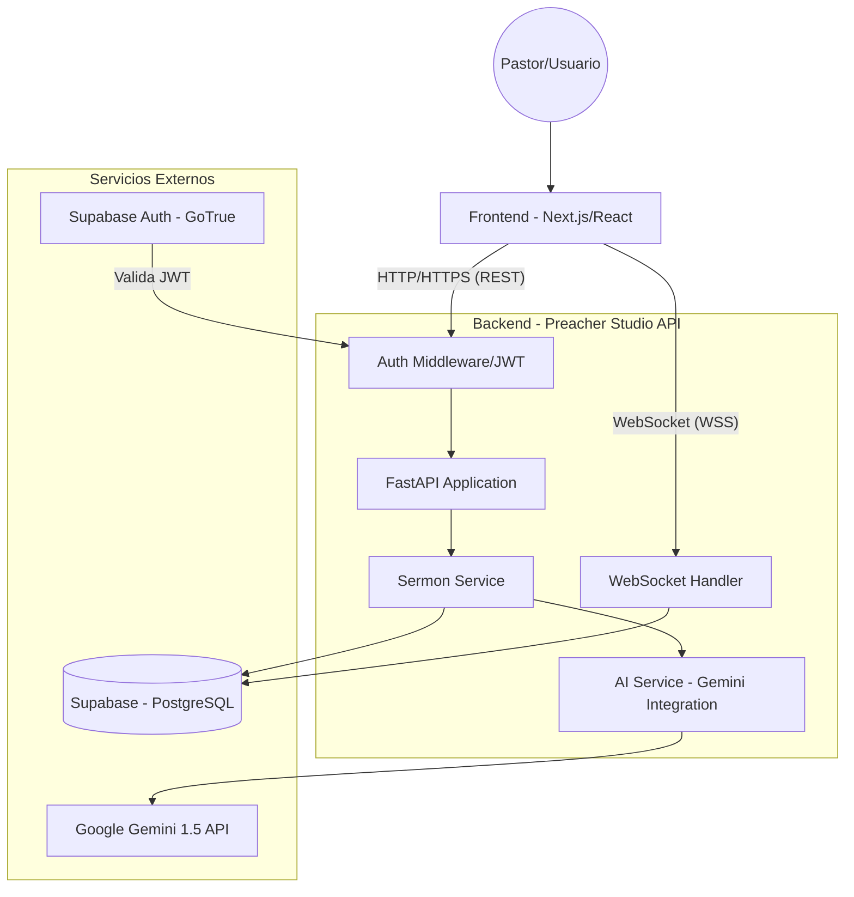

# 07 - Diseño del Sistema (System Design) - Preacher Studio API

Este documento describe la arquitectura de alto nivel y el flujo de datos entre los componentes del sistema.

## 1. Diagrama de Arquitectura de Alto Nivel (C4 L2)

## 2. Flujo de Datos Principal

### 2.1 Creación y Edición de Sermón
1. El **Frontend** envía una petición `POST` o `PATCH` con el contenido del sermón.
2. El **Auth Middleware** valida el JWT contra la llave secreta (compartida o configurada por Supabase).
3. El **Sermon Repository** interactúa con el cliente de **Supabase** para persistir los cambios en PostgreSQL.
4. Se devuelve una respuesta de éxito al Frontend para actualizar el estado local.

### 2.2 Flujo de Asistencia con IA (Homiletic Mentoring)
1. El **Usuario** solicita ayuda en un punto específico del sermón.
2. El **AIService** construye un prompt enriquecido con el contexto actual (título, notas, pasaje).
3. Se realiza una llamada asíncrona a la **Gemini API**.
4. La respuesta (JSON) es parseada, validada por un esquema de Pydantic y registrada en `llm_logs`.
5. El resultado se envía al Frontend para ser integrado en el editor.

### 2.3 Persistencia en Tiempo Real (WebSocket)
1. El **Frontend** establece una conexión persistente vía `ws://`.
2. Por cada cambio significativo en el editor, se envía un frame JSON con el nuevo `content`.
3. El **WSHandler** recibe el mensaje y ejecuta un `update` directo en Supabase.
4. Se envía una confirmación `{"status": "saved"}` para dar feedback visual al usuario (ej: indicador de "Guardado").

## 3. Decisiones Arquitectónicas Clave (ADR)

- **Desacoplamiento de Supabase:** Se utiliza el patrón Repository para que la lógica de negocio no dependa directamente de la sintaxis del cliente de Supabase, facilitando posibles migraciones a SQLAlchemy o Tortoise en el futuro.
- **Validación en el Lado del Servidor:** Aunque el frontend valide datos, el backend re-valida todo mediante Pydantic para asegurar la integridad de la base de datos.
- **Estrategia Asíncrona:** Todo el I/O (llamadas a DB, llamadas a IA) es no bloqueante (`async/await`), lo que permite manejar múltiples conexiones concurrentes con pocos recursos de CPU.
- **Seguridad "User-Centric":** El sistema asume que el `user_id` extraído del JWT es la fuente de verdad. Todas las consultas a la base de datos incluyen siempre el filtro `.eq("user_id", user_id)` para prevenir fugas de datos.

## 4. Consideraciones de Escalabilidad

- **Statelessness:** El backend es completamente sin estado (stateless). Se pueden levantar múltiples instancias detrás de un balanceador de carga sin necesidad de compartir memoria.
- **Connection Pooling:** Supabase maneja internamente el pooling de conexiones a PostgreSQL, lo que evita saturar la base de datos con aperturas y cierres constantes.
- **IA Rate Limiting:** La cuota de Gemini se gestiona a nivel de API Key. Para escalar, se podría implementar una cola de mensajes (Task Queue) si el volumen de peticiones de IA aumenta drásticamente.
